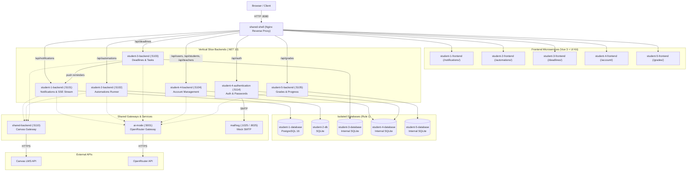

# 41026 Software Development Project (Better Canvas)

A microservices web platform built on top of the Canvas Infrastructure LMS API,
providing vertical slices for notifications, automations, deadlines, account
management, and grades/progress tracking.

---

## Architectural overview



---

## Services & Team Allocation

| Microservice | Member | Stack | Key Features |
|---|---|---|---|
| **`shared/backend`** | Shared | ASP.NET Core (.NET 10) + SQLite | Canvas LMS API gateway, in-memory caching (3-min TTL), HTML sanitization, audit log |
| **`shared/frontend`** | Shared | Vue 3 + TypeScript + Nginx | Shared dashboard shell, Nginx reverse proxy at `http://localhost:8080` |
| **`shared/ui-kit`** | Shared | SCSS + Vue 3 components | `@better-canvas/ui-kit` design system library |
| **`ai-services/ai-mode`** | Shared | Local ASP.NET Core (.NET 10) | Non-containerised OpenRouter LLM gateway (`/v1/chat/completions`) |
| **`ai-services/mcp-server`** | Shared | Local ASP.NET Core (.NET 10) | Non-containerised MCP tools accessed by Docker backends through `host.docker.internal` |
| **`ai-services/rag-server`** | Shared | Local ASP.NET Core (.NET 10) | Non-containerised grounded project-documentation retrieval and generation |
| **`student-1`** | Bryan Lee | ASP.NET Core + PostgreSQL 16 + Vue 3 | Notifications, delivery preferences, SSE stream, AI digests & chat assistant |
| **`student-2`** | Isaac Thomas | ASP.NET Core + SQLite + Vue 3 | Automations, scheduled Canvas posts, AI quiz filling, execution runner |
| **`student-3`** | Jonathon Thomson | ASP.NET Core + SQLite + Vue 3 | Deadlines & task tracking, Canvas sync, AI subtasks, push notifications |
| **`student-4`** | Tristan Huang | ASP.NET Core + SQLite + Vue 3 | User/role profiles, auth/login, MailHog password reset, AI profile summary |
| **`student-5`** | William Hannah | ASP.NET Core + SQLite + Vue 3 | Grades calculation, What-If simulator, marks update endpoints |
| **`mailhog`** | Infrastructure | Go SMTP test container | Local SMTP mock (`1025`) & web mailbox UI (`8025`) for email verification |

---

## Quick start (Docker Compose)

The easiest way to run the entire system is via Docker Compose:

```bash
# 1. Generate .env and enter your OpenRouter/Canvas credentials
python tools/setup_env.py

# 2. Build and launch the containerised application
docker compose up --build

# 3. In another terminal, launch all local AI services
python tools/run_ai_services.py
```

The setup command copies every non-secret default from `.env.example` and
prompts for credentials without echoing secrets. It refuses to replace an
existing `.env`; use `python tools/setup_env.py --force` when replacement is
intentional.

Access services via the shared shell at [http://localhost:8080](http://localhost:8080).

---

## Repository layout

```
.
├── ai-services/
│   ├── ai-mode/         # Non-containerised OpenRouter LLM proxy gateway
│   ├── mcp-server/      # Non-containerised MCP server
│   └── rag-server/      # Non-containerised grounded RAG server
├── shared/
│   ├── backend/         # Canvas LMS gateway + audit database
│   ├── frontend/        # Vue 3 dashboard shell + Nginx proxy
│   └── ui-kit/          # @better-canvas/ui-kit design system
├── student-1/           # Notifications vertical slice (Bryan Lee)
│   ├── backend/         # ASP.NET Core + EF Core PostgreSQL
│   ├── database/        # Dedicated PostgreSQL 16 container
│   └── frontend/        # Vue 3 + TypeScript + Playwright e2e
├── student-2/           # Automations vertical slice (Isaac Thomas)
│   ├── backend/         # ASP.NET Core + SQLite + runner
│   └── frontend/        # Vue 3 + TypeScript
├── student-3/           # Deadlines vertical slice (Jonathon Thomson)
│   ├── backend/         # ASP.NET Core public API
│   ├── database/        # Internal EF Core/SQLite persistence service
│   ├── contracts/       # Internal HTTP persistence contracts
│   └── frontend/        # Vue 3 + TypeScript
├── student-4/           # Account & Auth vertical slice (Tristan Huang)
│   ├── backend/         # ASP.NET Core Account API
│   ├── authentication/  # ASP.NET Core Auth & Password Reset API
│   ├── database/        # Internal EF Core/SQLite persistence service
│   ├── contracts/       # Internal HTTP persistence contracts
│   └── frontend/        # Vue 3 + TypeScript
├── student-5/           # Grades & Progress vertical slice (William Hannah)
│   ├── backend/         # ASP.NET Core GradesManager API
│   ├── database/        # Internal EF Core/SQLite persistence service
│   ├── contracts/       # Internal HTTP persistence contracts
│   └── frontend/        # Vue 3 + TypeScript
├── docs/                # Full architecture, runbooks, and playbooks
├── tools/               # Multi-agent architecture and code evaluation runner
├── .github/workflows/   # CI workflows per service group
├── docker-compose.yml
└── .env.example
```

## Service communication

Microservices communicate over HTTP and own strictly isolated databases.
They must not query another service's database directly. The shared backend
owns Canvas authentication and API pagination.

- **Student 1**: NotificationService connects directly to its dedicated PostgreSQL container `student-1-database`.
- **Student 2**: Automations backend stores data in its dedicated SQLite database `student-2-db`.
- **Student 3**: Deadlines backend delegates all persistence to `student-3-database` over an internal private network (`student-3-data`).
- **Student 4**: Account and Authentication backends delegate persistence to `student-4-database` over an internal private network (`student-4-data`), and auth sends emails via MailHog.
- **Student 5**: Grades backend delegates persistence to `student-5-database` over an internal private network (`student-5-data`).

To import Canvas data, start the services and call:

```http
POST http://localhost:5103/api/canvas-sync
```

The sync fetches active courses and their assignments, then
transactionally upserts one task per stable Canvas assignment ID.
Removed assignments are marked inactive rather than deleted. Canvas
data remains live in the shared service; only the source IDs and
fields needed by courses/tasks are persisted by the task tracker. A
submitted or graded assignment marks its task as completed; other
Canvas submission states do not overwrite the task's local status.

The shared Canvas and task-tracker databases persist timestamps as
`DateTime` normalized to UTC.

## Running a single service outside Docker

AI Mode, MCP, and RAG intentionally run outside Docker. After starting
Compose, launch all three host services from the repository root:

```bash
python tools/run_ai_services.py
```

The launcher loads OpenRouter configuration from the root `.env`, prepares
the curated RAG corpus, starts all three .NET projects, waits for their
readiness endpoints, and stops all processes together.

Each backend is a standalone ASP.NET project (`Api/` for most slices,
`backend/GradesManager/GradesManager/` for student 5). The easiest way
to iterate is still `docker compose up`, but a backend will run with
`dotnet run` from its own project directory provided you supply the env
vars it needs (notably `OPENROUTER_API_KEY` for AI features,
`SharedService__BaseUrl` for any service that calls into the Canvas
gateway, and `DatabaseService__BaseUrl` for students 3, 4, and 5). See
`docs/architecture/overview.md` for the per-service env-var reference.

Each frontend is a Vite + Vue 3 project. Run it with `npm run dev --workspace=<workspace-name>`
from the repository root.

## Continuous integration

Workflows under `.github/workflows/`:

- `docker-ci.yml` — Docker image build and Compose contract validation for the full stack (fires on any change under `ai-services/`, `shared/`, `student-*/`, `docker-compose.yml`, `package.json`, `package-lock.json`, or `.env.example`).
- `shared-ci.yml` — Shared shell and backend build, format check, EF migrations drift check, and NuGet vulnerability scan.
- `student-1-ci.yml` — Notifications frontend build + Playwright E2E, .NET build/test/format check, EF migration drift check, and NuGet audit.
- `student-2-ci.yml` — Automations frontend build, .NET build/format check, EF migration drift check, and NuGet audit.
- `student-3-ci.yml` — Deadlines frontend build, .NET build/format check, API contract smoke test, EF migration drift check, and NuGet audit.
- `student-4-ci.yml` — Account & Auth frontend build, .NET build/format check, EF migration drift check, and NuGet audit.
- `student-5-ci.yml` — Grades frontend build, .NET build/format check, API contract smoke test, EF migration drift check, and NuGet audit.

Workflows run on PRs targeting `main` and pushes to `main`.

## Release 0: Summary

Working branch: `release-0`
Feature set:
- **Shared infrastructure**: Dashboard shell, `@better-canvas/ui-kit` Neobrutalism design system, Canvas LMS API gateway with caching/sanitization, OpenRouter AI mode gateway, and MailHog mock SMTP.
- **Student 1 (Notifications)**: Delivery preferences, notification management, real-time SSE streaming broker, and AI digests and chat assistant backed by PostgreSQL.
- **Student 2 (Automations)**: Assignment extension requests, scheduled Canvas posts via Canvas Conversations, AI quiz filling via `ai-mode`, and execution run history.
- **Student 3 (Deadlines & Tasks)**: Deadline/task CRUD, course linkage, filtering, Canvas synchronization, AI subtask breakdown, internal database microservice, and real-time push notification integration.
- **Student 4 (Account & Authentication)**: Account management, secure password hashing, AI profile summaries, authentication API, password reset workflow via MailHog, and internal database microservice.
- **Student 5 (Grades & Progress)**: Grades aggregation, what-if marks simulator, marks update endpoints, and internal database microservice.

All five slices are wired into the shared shell. Release 1 work builds on this baseline and adds RAG and MCP support for ai-mode.
