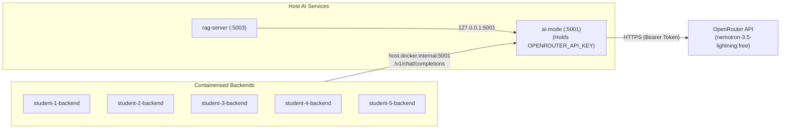

# ai-mode gateway

Shared non-containerised OpenRouter proxy. Use this once your feature needs AI-mode — no
need for your own OpenRouter key or account, gateway already holds shared
one.



## Calling it

Start the shared AI services from the repository root:

```bash
python tools/run_ai_services.py
```

From inside a backend container:

```http
POST http://host.docker.internal:5001/v1/chat/completions
```

Same request shape as OpenAI's chat completions API:

```json
{
  "messages": [
    { "role": "user", "content": "Summarise these notifications..." }
  ]
}
```

The response body is passed through unchanged. If a provider embeds an
`error` object inside an HTTP 200 response, the gateway converts its error
code into the HTTP response status so callers can handle and retry it
correctly.

## Model

When a request omits `model`, AI Mode uses the required `OPENROUTER_MODEL`
value generated from `.env.example`. A request can still override that model
explicitly.

## Health

AI Mode is not a Docker Compose service. Its `/health/live` endpoint reports
process liveness and `/health/ready` verifies that the OpenRouter key and
model loaded from the root `.env` are configured.
