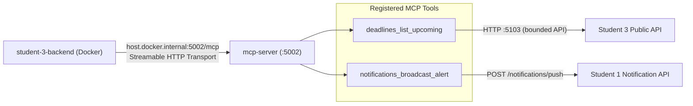

# MCP Server

Shared non-containerised ASP.NET Core service for controlled Model Context
Protocol tools using the official C# MCP SDK and stateless Streamable HTTP
transport.



## Registered tools

### `deadlines_list_upcoming`

- Caller: `student-3-backend`
- Inputs: `days` (`1`-`90`), `limit` (`1`-`50`)
- Output: incomplete tasks due in the requested window
- Boundary: reads through Student 3's bounded HTTP API; it never accesses the
  Student 3 database service or volume directly

Run it together with the RAG service from the repository root:

```bash
python tools/run_ai_services.py
```

The MCP endpoint is `http://127.0.0.1:5002/mcp` by default. The launcher
configures its Student 3 dependency as `http://127.0.0.1:5103`; the
containerised Student 3 backend reaches MCP through
`http://host.docker.internal:5002/mcp`.
