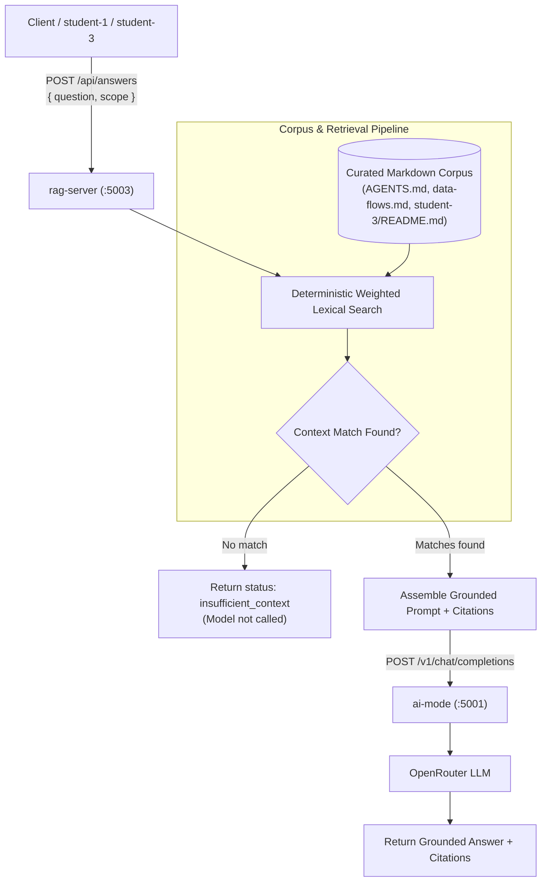

# RAG Server

Shared non-containerised ASP.NET Core service for retrieval-augmented
generation. It indexes a curated, read-only Markdown corpus at startup,
retrieves relevant sections with deterministic weighted lexical search, and
sends only those sections to `ai-mode` for grounded generation through
OpenRouter.



`POST /api/answers` accepts a question and the `student-3` scope. Responses
include source citations, a deterministic confidence category, and retrieval
counts. Questions without a relevant corpus match return
`insufficient_context` without calling the model.

The initial corpus contains `AGENTS.md`, `docs/architecture/data-flows.md`, and
`student-3/README.md`. Adding a vector store or embedding service is deferred
until corpus size or retrieval quality justifies the additional infrastructure.

Run it together with MCP from the repository root:

```bash
python tools/run_ai_services.py
```

The RAG endpoint is `http://127.0.0.1:5003/api/answers` by default. The
launcher copies the three curated sources into an isolated temporary corpus
and configures RAG to call host AI Mode at `http://127.0.0.1:5001`.
