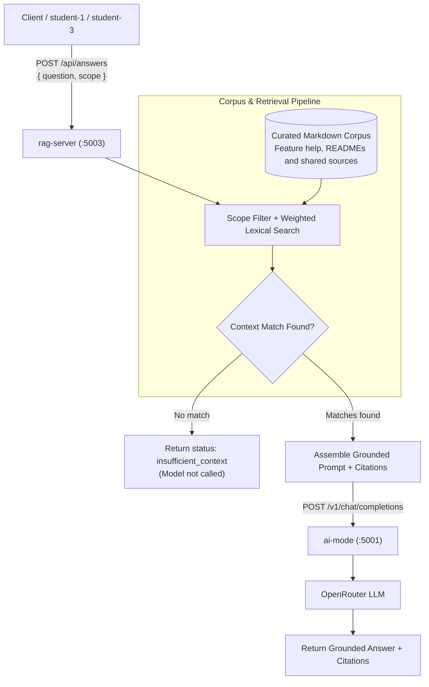

# RAG Server

Shared non-containerised ASP.NET Core service for retrieval-augmented
generation. It indexes a curated, read-only Markdown corpus at startup,
retrieves relevant sections with deterministic weighted lexical search, and
sends only those sections to `ai-mode` for grounded generation through
OpenRouter.



`POST /api/answers` accepts a question and an optional scope: `student-1`
through `student-5`, `shared`, or `all`. Omitting the scope defaults to
`student-3`; an explicitly empty scope is treated as `all`. Feature scopes retrieve
only their `student-x/` sources and explicitly shared documentation. Shared
sources are paths under `shared/`, `AGENTS.md`,
`docs/architecture/data-flows.md`, and
`docs/knowledge-base/course_policies.md`. The `shared` scope excludes
student-specific sources; `all` searches the full curated corpus. Responses
include source citations, a deterministic confidence category, and retrieval
counts. Considered chunks count only sources eligible for the selected scope.
Questions without a relevant corpus match return
`insufficient_context` without calling the model.

The launcher corpus contains `AGENTS.md`, `docs/architecture/data-flows.md`,
`student-1/README.md`, `student-3/README.md`,
`student-3/docs/deadline-help.md`, and
`docs/knowledge-base/course_policies.md`. Adding a vector store or embedding service is deferred
until corpus size or retrieval quality justifies the additional infrastructure.

Run it together with MCP from the repository root:

```bash
python tools/run_ai_services.py
```

The RAG endpoint is `http://127.0.0.1:5003/api/answers` by default. The
launcher copies these curated sources into an isolated temporary corpus
and configures RAG to call host AI Mode at `http://127.0.0.1:5001`.
Restart the launcher after changing sources to rebuild the startup index.
