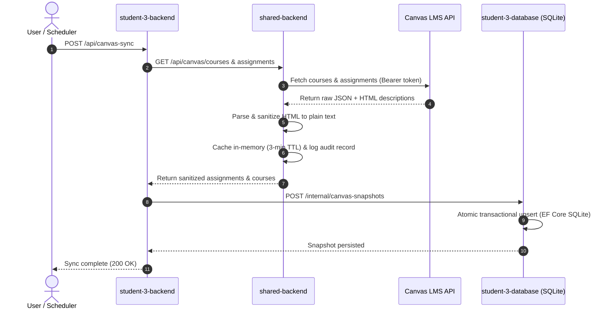
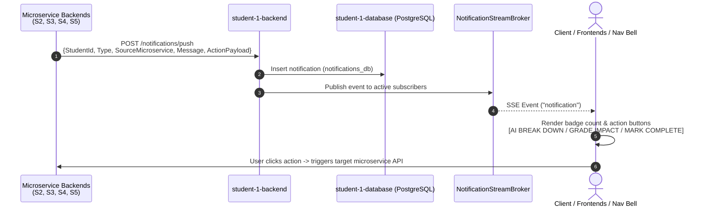
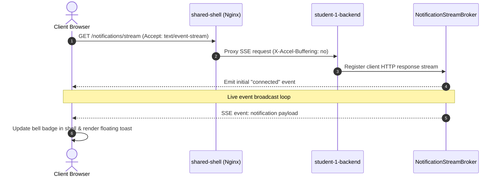
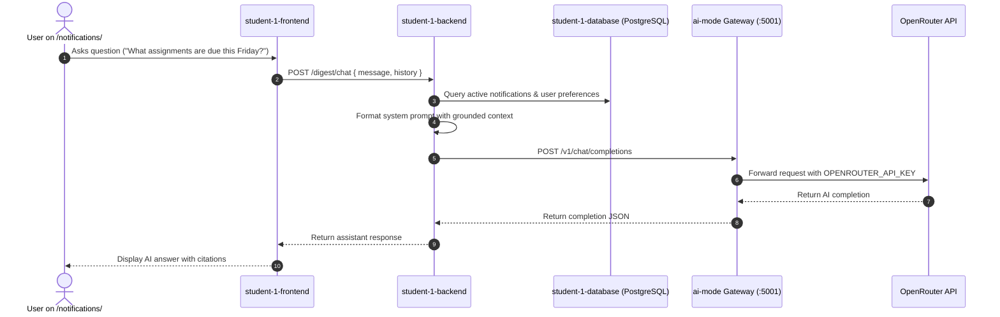
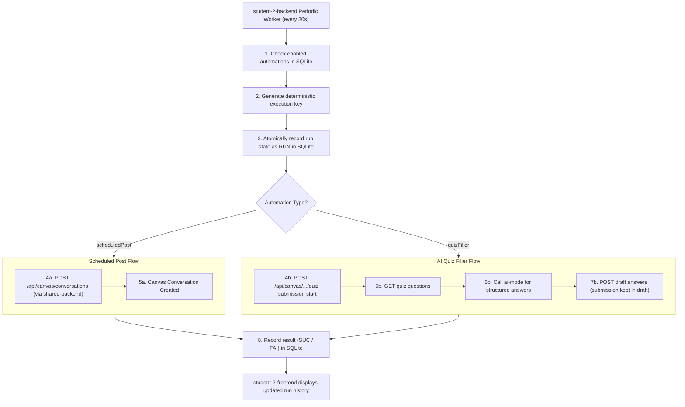
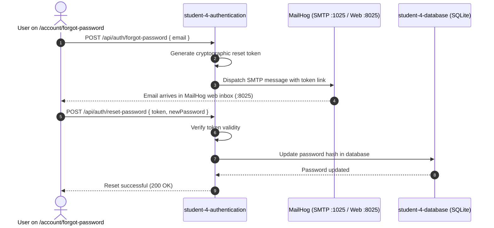
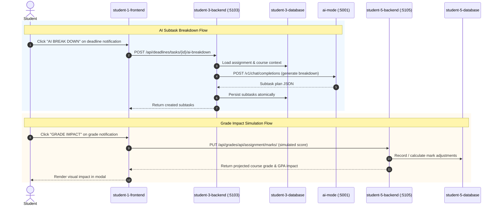

# Cross-Service Data Flows & Sequence Walkthroughs

This document traces the primary end-to-end data flows and lifecycle sequences across the microservices ecosystem.

---

## 1. Canvas Assignment Sync & Task Ingestion

### Steps:
1. Client calls `POST /api/canvas-sync` on `student-3-backend`.
2. `student-3-backend` issues internal HTTP requests to `shared-backend` (`http://shared-backend:8080/api/canvas/*`).
3. `shared-backend` forwards request with `CANVAS_API_TOKEN` to Canvas.
4. Canvas returns course and assignment entities containing HTML descriptions.
5. `shared-backend` cleans untrusted markup, producing clean plain text.
6. `student-3-backend` validates and submits one complete snapshot to `student-3-database`.
7. `student-3-database` performs atomic database upserts:
   - New assignments become active tasks.
   - Deleted assignments in Canvas receive `CanvasIsActive = false` (never hard-deleted).
   - Submissions graded/submitted in Canvas mark the task `IsCompleted = true`.

---

## 2. Cross-Microservice Push Notifications & Action Triggers

All vertical slice microservices link to `student-1-backend` (`NotificationService`) via resilient HTTP clients pushing event notifications to `POST /notifications/push`:

---

## 3. Real-Time SSE Notification Streaming

---

## 4. Conversational AI Digest Assistant

---

## 5. Automated Execution Flow (Scheduled Canvas Posts & AI Quiz Filling)

---

## 6. Account Password Reset Flow (MailHog SMTP)

---

## 7. Cross-Service Action Triggers (`AI BREAK DOWN` & `GRADE IMPACT`)

### AI Subtask Breakdown Flow
1. User clicks `AI BREAK DOWN` on a Deadline notification.
2. `student-1-frontend` opens `BreakdownDialog.vue`.
3. Modal calls `POST /api/deadlines/tasks/{id}/ai-breakdown` on `student-3-backend`.
4. `student-3-backend` loads assignment context through `student-3-database`, calls `ai-mode`, validates generated subtasks, and sends one bulk command back to the database service for atomic persistence.

### Grade Impact Simulation Flow
1. User clicks `GRADE IMPACT` on a Grade notification.
2. `student-1-frontend` opens `GradeImpactDialog.vue`.
3. Modal retrieves assignment mark weightings and submits simulated scores to `PUT /api/grades/api/assignment/marks/` on `student-5-backend` (which persists via `student-5-database`).
4. Student visualizes live GPA / course percentage impact.

