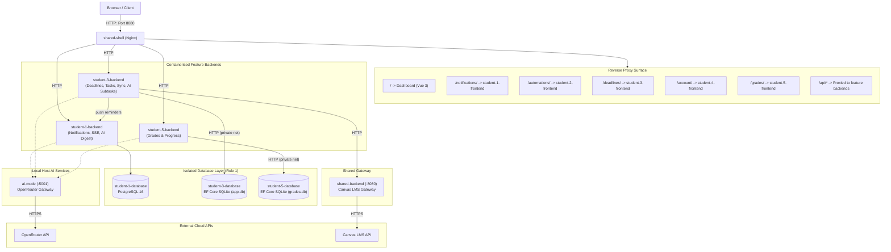

# System Architecture Overview

> **Authoritative Architectural Specification for Better Canvas**  
> Workspace: `41026--software-development-project`  
> Topology: Containerised feature microservices plus local AI services, Nginx Reverse Proxy, ASP.NET Core & Vue 3

---

## 1. High-Level System Architecture

Better Canvas is an **LLM-enhanced microservices web platform** designed around autonomous vertical slices. Each student owns a bounded business context, backed by dedicated infrastructure services for Canvas LMS connectivity, OpenRouter AI completions, and unified dashboard proxying.

Release 1 runs AI Mode, MCP, and RAG as local host processes, not Docker
Compose services. Containerised feature backends reach them through
`host.docker.internal`; the services are launched together by
`python tools/run_ai_services.py`.

---

## 2. Core Service Topology

```mermaid
flowchart TD
    Client["Browser / Client"] -- "HTTP :8080" --> Shell["shared-shell (Nginx)"]

    subgraph S1Slice["student-1 (Notifications)"]
        F1["/notifications/ (frontend)"]
        B1["student-1-backend (:5101)"]
        DB1[("student-1-database (PostgreSQL)")]
        F1 -.-> Shell
        B1 --> DB1
    end

    subgraph S2Slice["student-2 (Automations)"]
        F2["/automations/ (frontend)"]
        B2["student-2-backend (:5102)"]
        DB2[("owned SQLite db")]
        F2 -.-> Shell
        B2 --> DB2
    end

    subgraph S3Slice["student-3 (Deadlines & Tasks)"]
        F3["/deadlines/ (frontend)"]
        B3["student-3-backend (:5103)"]
        DB3[("student-3-database (SQLite)")]
        F3 -.-> Shell
        B3 --> DB3
    end

    subgraph S4Slice["student-4 (Account & Auth)"]
        F4["/account/ (frontend)"]
        B4["student-4-backend (:5104)"]
        A4["student-4-authentication (:5114)"]
        DB4[("student-4-database (SQLite)")]
        MH["MailHog (:1025/:8025)"]
        F4 -.-> Shell
        B4 --> DB4
        A4 --> DB4
        A4 -- "password-reset email" --> MH
    end

    subgraph S5Slice["student-5 (Grades & Progress)"]
        F5["/grades/ (frontend)"]
        B5["student-5-backend (:5105)"]
        DB5[("student-5-database (SQLite)")]
        F5 -.-> Shell
        B5 --> DB5
    end

    subgraph SharedAndAI["Shared & AI Gateways"]
        SB["shared-backend (:5110)"]
        AIM["ai-mode (host :5001)"]
        MCP["MCP Server (host :5002)"]
        RAG["RAG Server (host :5003)"]
        CanvasAPI["Canvas LMS API"]
        OpenRouterAPI["OpenRouter API"]
    end

    Shell -- "/notifications/, /api/notifications" --> B1
    Shell -- "/automations/, /api/automations" --> B2
    Shell -- "/deadlines/, /api/deadlines" --> B3
    Shell -- "/api/users, /api/students, /api/teachers" --> B4
    Shell -- "/account/, /api/auth" --> A4
    Shell -- "/grades/, /api/grades" --> B5

    B1 -.-> SB & AIM
    B2 -.-> SB & AIM
    B3 -.-> SB & AIM
    B3 -- "push reminders" --> B1
    B4 -.-> AIM
    B5 -.-> AIM

    B3 -- "host.docker.internal:5002" --> MCP
    MCP -- "localhost:5103" --> B3
    B3 -- "host.docker.internal:5003" --> RAG
    RAG -- "localhost:5001" --> AIM

    SB -- "HTTPS" --> CanvasAPI
    AIM -- "HTTPS" --> OpenRouterAPI
```

### Infrastructure & Shared Services
- **`shared-shell`** (Port 8080): Vue 3 shell dashboard and Nginx reverse proxy routing web requests and API paths.
- **`shared-backend`** (Port 5110): Exclusive Canvas LMS API client with 3-minute in-memory caching and HTML sanitization.
- **`ai-mode`** (Host 5001): Non-containerised chat completions gateway proxying requests to OpenRouter LLMs.
- **`mcp-server`** (Host 5002): Non-containerised MCP server exposing bounded tools; Students 1, 3, and 4 reach it through `host.docker.internal`.
- **`rag-server`** (Host 5003): Non-containerised grounded-answer service using curated project documentation and AI Mode through its loopback-only port 5001.
- **`mailhog`** (SMTP: 1025 / Web UI: 8025): Local SMTP mock service for developer email verification.

### Vertical Microservice Slices
- **`student-1` (Notifications)**: Notification management, delivery preferences, SSE stream broker, AI digest generation and conversational assistant (`student-1-database` PostgreSQL 16 on port 5432).
- **`student-2` (Automations)**: Assignment extension requests, scheduled Canvas posts, AI quiz answering with `ai-mode`, and periodic execution runner.
- **`student-3` (Deadlines & Tasks)**: Coursework deadlines, subtask hierarchies, Canvas synchronization, AI breakdown planning, and push notifications to `student-1-backend` (`student-3-database` internal SQLite service on `student-3-data`).
- **`student-4` (Account & Authentication)**: User registration, login authentication, MailHog password reset workflows, profile AI summaries (`student-4-database` internal SQLite service on `student-4-data`).
- **`student-5` (Grades & Progress)**: Marks calculation, target GPA simulation ("what-if" marks), and progress tracking (`student-5-database` internal SQLite service on `student-5-data`).

---

## 3. Reverse Proxy Routing (shared-shell)

The Nginx server running inside `shared-shell` is the sole entry point exposed on port `8080`. It routes requests dynamically:

- `/` → Serves the dashboard shell (`shared/frontend/dist`).
- `/notifications/` → Proxies to `http://student-1-frontend:80/`.
- `/api/notifications/` → Proxies to `http://student-1-backend:8080/` (120s read timeout for SSE and AI calls).
- `/automations/` → Proxies to `http://student-2-frontend:80/`.
- `/api/automations/` → Proxies to `http://student-2-backend:8080/api/`.
- `/deadlines/` → Proxies to `http://student-3-frontend:80/`.
- `/api/deadlines/` → Proxies to `http://student-3-backend:8080/api/`.
- `/account/` → Proxies to `http://student-4-frontend:80/`.
- `/api/auth/` → Proxies to `http://student-4-authentication:8080/`.
- `/api/users/`, `/api/students/`, `/api/teachers/` → Proxy to `http://student-4-backend:8080/`.
- `/grades/` → Proxies to `http://student-5-frontend:80/`.
- `/api/grades/` → Proxies to `http://student-5-backend:8080/`.

Bare paths (`/automations`, `/deadlines`, `/account`, `/grades`) redirect
permanently to their trailing-slash form.

---

## 4. Cross-Service Boundaries & Communication Rules

### Database Isolation
Each bounded context maintains its own strictly isolated persistence mechanism:
- **`student-1`**: Runs a dedicated PostgreSQL 16 container (`student-1-database`) mounting named volume `student-1-postgres-data`.
- **`student-2`**: Runs SQLite with persistent volume `student-2-db`.
- **`student-3`**: Dedicated internal database service `student-3-database` exclusively mounts `student-3-db` on the private `student-3-data` network.
- **`student-4`**: Dedicated internal database service `student-4-database` exclusively mounts `student-4-db` on the private `student-4-data` network.
- **`student-5`**: Dedicated internal database service `student-5-database` exclusively mounts `student-5-db` on the private `student-5-data` network.
- **`shared-backend`**: Dedicated SQLite audit log mounting `shared-db`.

No service reads or writes another service's database directly; all cross-service communication occurs over HTTP.
Direct database connection strings point only to the local service database.
`student-3-database`, `student-4-database`, and `student-5-database` exclusively mount their volumes; the matching public APIs use internal HTTP contracts and contain no EF Core dependency.
Each of those database services is attached only to its internal `student-N-data` Docker network. The matching public services join both that private network and the default application network; no other service can directly reach a private persistence API.

### Canvas Data Boundary
- `shared-backend` holds the `CANVAS_BASE_URL` and `CANVAS_API_TOKEN`.
- Canvas assignment descriptions are converted from raw, untrusted HTML into clean plain text before returning DTOs to caller backends.
- Course, assignment, and user responses are cached in-memory with a 3-minute TTL to minimize redundant Canvas requests.

### Centralized AI Mode Boundary
- `ai-services/ai-mode` is the only service that reads `OPENROUTER_API_KEY`.
- Docker backends send chat completion requests to
  `http://host.docker.internal:5001/v1/chat/completions`.
- Host RAG reaches AI Mode directly through `http://127.0.0.1:5001`.
- `OPENROUTER_MODEL` is required and sourced from the generated `.env`; individual requests may override it.

### AI Services Host Boundary
- AI Mode, MCP, and RAG are .NET host processes and are not defined in
  `docker-compose.yml`.
- `tools/run_ai_services.py` loads OpenRouter configuration, prepares the
  curated RAG corpus, starts all three services, waits for readiness, streams
  prefixed logs, and shuts them down together.
- Student 3 uses `host.docker.internal:5002` for MCP and
  `host.docker.internal:5003` for RAG. Both integrations remain optional and
  never participate in Student 3 readiness.
- MCP accesses Student 3 only through its bounded host-published HTTP API; RAG
  does not access feature databases.
- RAG feature scopes retrieve only their `student-x/` sources plus explicitly
  shared sources (`shared/`, `AGENTS.md`, the architecture data flows and course
  policies). `shared` excludes student-specific sources; `all` retains
  full-corpus retrieval. Student 3 also indexes its Deadline Tracker help guide.

---

## 5. Key System Capabilities

### A. Real-Time SSE Notification Streaming
- `student-1-backend` exposes `GET /notifications/stream` emitting Server-Sent Events (`text/event-stream`).
- An in-memory broker (`NotificationStreamBroker`) publishes events whenever Canvas sync detects updates or external services push reminders.
- `shared-shell` and `student-1-frontend` maintain persistent SSE connections to update badge counts and display toast alerts without polling.

### B. Cross-Microservice Action Triggers
Notifications carry structured action metadata enabling cross-service operations directly from the notifications interface:
- **`AI BREAK DOWN`**: Triggers a modal calling `POST /api/deadlines/tasks/{id}/ai-breakdown` on `student-3-backend` to generate actionable subtasks with AI.
- **`GRADE IMPACT`**: Triggers a modal calling `PUT /api/grades/api/assignment/marks/` on `student-5-backend` to simulate grade changes.
- **`MARK COMPLETE`**: Calls `PUT /api/deadlines/tasks/{id}` on `student-3-backend` to mark a task done inline.

### C. Conversational AI Digest Assistant
- `student-1-backend` provides `POST /digest/chat` backed by `OpenRouterDigestService`.
- The assistant is dynamically grounded with the student's unread notifications and course context, allowing interactive multi-turn questions ("What deadlines do I have this week?", "Explain the feedback on Assignment 1").

### D. Scheduled Canvas Automations
- `student-2-backend` stores assignment-extension, scheduled-post, and quiz-filler automations in its owned SQLite database.
- A periodic execution worker durably claims due work, accesses Canvas only through `shared-backend`, and records execution history.
- Quiz-filler automations send eligible Canvas quiz questions to `ai-mode`, validate the structured answers, and save draft attempts through the Canvas gateway without automatically submitting.

### E. Account, Authentication, and AI Profiles
- `student-4-authentication` provides login, password change, account deletion, and email password-reset workflows; both authentication and profile APIs access `student-4-database` exclusively over HTTP.
- Development password-reset messages are delivered to MailHog, whose web inbox is exposed on port `8025`.
- `student-4-backend` can generate a replacement profile summary through `ai-mode` using the stored user and student/teacher profile context.
- Student 4's **03 KNOWLEDGE** page (`/account/knowledge`) calls `POST /api/users/{userId}/mcp-readiness` to
  invoke the shared local `accounts_check_readiness` MCP tool. MCP calls back
  through `/internal/ai-context/accounts/{userId}/readiness` on Student 4's
  backend. It evaluates profile completeness and role setup through its
  private database API, probes Canvas through the shared gateway's course
  API, and checks notification readiness over HTTP. Results contain four
  actionable findings and an overall `ready`, `needs_attention`, or
  `unavailable` category, not duplicated profile values. The tool cannot
  mutate accounts or return credentials. These optional checks do not gate
  backend readiness; MCP is disabled in CI.
- Student 4's **Account Help / RAG** panel on **03 KNOWLEDGE** routes documentation questions
  through `POST /api/users/help/answers` to local RAG on host port `5003`.
  The backend fixes scope to `student-4`; RAG retrieves only the account
  README and account-help guide, then sends excerpts through local AI Mode.
  Answers display server-derived citations and retrieval-based confidence.
  No relevant context bypasses the model and returns insufficient context.
  RAG never reads private account data or executes account actions, remains
  optional for readiness, and is explicitly disabled in Student 4 CI.

---

## 6. Shared Design System: `@better-canvas/ui-kit`

All frontends share the workspace package `@better-canvas/ui-kit` (`shared/ui-kit`):
- **Neobrutalism Aesthetics**:
  - Border radius: `--nb-border-radius: 0` (strict sharp corners).
  - Borders: `var(--nb-border-width-md) solid var(--nb-color-ink)` (2/3/4px `sm`/`md`/`lg` high-contrast ink borders).
  - Shadows: `var(--nb-shadow)` — a hard, unblurred `6px 6px 0 var(--nb-color-shadow)` drop shadow.
  - Palette: High-contrast concrete surface (`--nb-color-bg`), safety-orange and hazard-yellow accents (`--nb-color-accent-orange`, `--nb-color-accent-yellow`), muted meta text (`--nb-color-muted`).
- **Animations & Micro-interactions**:
  - Standard duration and easing tokens (`--nb-duration-base`, `--nb-ease-out`, `--nb-ease-pop`).
  - Subtle spring transforms on hover and active states (`transform: translate(-2px, -2px)` with expanded shadow).
