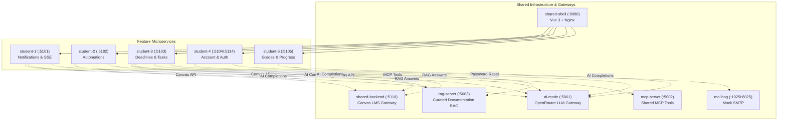

# Microservices Catalog & Service Directory

> Detailed specification of each microservice, its stack, endpoint surface, port mappings, and operational ownership.

---

## 1. `shared-shell` (Dashboard Shell & Gateway Proxy)

- **Path**: `shared/frontend/`
- **Stack**: Vue 3 + TypeScript + Vite + Nginx (Alpine) + `@better-canvas/ui-kit`
- **Port (Host)**: `8080` (mapped to Nginx `80` inside container)
- **Owner**: Shared Infrastructure

### Responsibilities
- Serves the global top navigation, system health status, and unified dashboard widgets.
- Proxies all frontend paths (`/notifications/`, `/automations/`, `/deadlines/`, `/account/`, `/grades/`) to their respective microservice frontend containers.
- Proxies all backend APIs under `/api/*` to the appropriate internal services.
- Connects to `student-1-backend` SSE endpoint to render the real-time unread notification count badge in the navbar.

---

## 2. `shared-backend` (Canvas LMS Gateway & Audit)

- **Path**: `shared/backend/`
- **Stack**: ASP.NET Core (.NET 10) + EF Core SQLite (`shared-db`)
- **Port (Host)**: `5110` (mapped to `8080` inside container)
- **Owner**: Shared Infrastructure

### Responsibilities
- Exclusive gateway for interacting with the institution's Canvas LMS API.
- Converts untrusted Canvas assignment descriptions (rich HTML) to clean plain text.
- Maintains a 3-minute in-memory cache (`IMemoryCache`) for Canvas responses to avoid rate limits.
- Persists an immutable SQLite audit log (`app.db`) for all outgoing Canvas API requests.

### Key Endpoints
- `GET /api/canvas/courses` — Active courses list.
- `GET /api/canvas/courses/{courseId}/assignments` — Assignments for a course (with plain text sanitized descriptions).
- `GET /api/canvas/courses/{courseId}/users` — Enrolled users/students.
- `GET /api/canvas/courses/{courseId}/quizzes` — Course quizzes.
- `GET /api/canvas/audit-logs` — Read audit logs.

---

## 3. `ai-mode` (OpenRouter LLM Gateway)

- **Path**: `ai-services/ai-mode/`
- **Stack**: ASP.NET Core (.NET 10) Minimal API
- **Port (Host)**: `5001` (non-containerised; Docker callers use `host.docker.internal`)
- **Owner**: Shared Infrastructure

### Responsibilities
- Sole holder of `OPENROUTER_API_KEY` secret.
- Proxies chat-completions requests from downstream backends to OpenRouter models (default: `nvidia/nemotron-3.5-lightning:free`).
- Provides standardized error handling, request timeouts, and health checks (`/health/live`, `/health/ready`).

### Key Endpoints
- `POST /v1/chat/completions` — OpenAI-compatible chat completions endpoint.
- `GET /health/live` & `GET /health/ready` — Process health probes.

---

## 4. `student-1` (Notifications Microservice)

- **Path**: `student-1/backend/`, `student-1/database/`, and `student-1/frontend/`
- **Stack**:
  - Backend: ASP.NET Core (.NET 10) + EF Core PostgreSQL (`Npgsql`)
  - Database: PostgreSQL 16 Alpine container (`student-1-database`, `notifications_db`)
  - Frontend: Vue 3 + TypeScript + Vite + `@better-canvas/ui-kit`
- **Port (Host)**: `5101` (Backend), `5432` (PostgreSQL), Proxied at `/notifications/` (Frontend)
- **Owner**: Student 1 (Bryan Lee)

### Responsibilities
- Stores notification entries, student delivery channel preferences, and digest summaries.
- Provides real-time Server-Sent Events (SSE) streaming (`GET /notifications/stream`).
- Exposes push ingestion API (`POST /notifications/push`) used by `student-3-backend` for deadline reminders.
- Implements AI-powered notification digest generation and conversational assistant grounded on user notifications.

### Key Endpoints
- `GET /notifications` & `POST /notifications` — List and create notifications.
- `PUT /notifications/{id}/read` & `PUT /notifications/read-all` — Mark notifications read.
- `GET /notifications/stream` — SSE event stream.
- `POST /notifications/push` — Push notification from external microservice.
- `GET /preferences` & `PUT /preferences` — Delivery preference settings.
- `GET /digest/generate` & `POST /digest/chat` — AI digest generation and chat.

---

## 5. `student-2` (Automations Microservice)

- **Path**: `student-2/backend/` and `student-2/frontend/`
- **Stack**:
  - Backend: ASP.NET Core (.NET 10) + EF Core SQLite + periodic execution worker
  - Frontend: Vue 3 + TypeScript + Vite + `@better-canvas/ui-kit`
- **Port (Host)**: `5102` (Backend), Proxied at `/automations/` (Frontend)
- **Owner**: Student 2 (Isaac Thomas)

### Responsibilities
- Stores assignment-extension, scheduled-post, and quiz-filler automation configurations in polymorphic EF Core tables.
- Runs a background worker (default every 30 seconds) that claims due execution candidates with durable execution keys before contacting Canvas.
- Executes scheduled Canvas conversations and AI-assisted Classic Quiz filling through `shared-backend` and `ai-mode`; it never turns a quiz in automatically.
- Dispatches real-time push notifications to `student-1-backend` upon automation execution (success/failure) and configuration updates.
- Exposes read-only run history.

### Key Endpoints
- `/api/automations` — Automation CRUD (polymorphic `$type` payloads).
- `/api/automation-runs` — Read-only run history.
- Swagger UI in Development at `http://localhost:5102/swagger`.

See [`student-2/README.md`](../../student-2/README.md) for the full contract.

---

## 6. `student-3` (Deadlines & Task Tracker Microservice)

- **Path**: `student-3/backend/`, `student-3/database/`, `student-3/contracts/`, and `student-3/frontend/`
- **Stack**:
  - Backend: ASP.NET Core (.NET 10), public API and orchestration
  - Database: ASP.NET Core (.NET 10) + EF Core SQLite, internal-only on `student-3-data`
  - Frontend: Vue 3 + TypeScript + Vite + `@better-canvas/ui-kit`
- **Port (Host)**: `5103` (Backend), `5203` (database when run standalone), Proxied at `/deadlines/` (Frontend)
- **Owner**: Student 3 (Jonathon Thomson)

### Responsibilities
- Manages coursework tasks, subtasks, priorities, completion states, and due dates.
- Ingests Canvas assignments via `POST /api/canvas-sync` through `shared-backend`.
- Periodically runs `DueSoonReminderBackgroundService` to dispatch reminders to `student-1-backend`.
- Dispatches real-time push notifications to `student-1-backend` upon task creation and AI breakdown.
- Provides AI-assisted subtask planning (`POST /api/deadlines/tasks/{id}/ai-breakdown`).
- Delegates all persistence over HTTP to `student-3-database`.

### Key Endpoints
- `GET /api/deadlines/tasks` & `POST /api/deadlines/tasks` — Task CRUD.
- `PUT /api/deadlines/tasks/{id}` & `DELETE /api/deadlines/tasks/{id}` — Task update/delete.
- `POST /api/canvas-sync` — Trigger sync with Canvas gateway.
- `POST /api/deadlines/tasks/{id}/ai-breakdown` — Generate AI task breakdown subtasks.

---

## 7. `student-4` (Account & Authentication Microservice)

- **Path**: `student-4/backend/`, `student-4/authentication/`, `student-4/database/`, `student-4/contracts/`, and `student-4/frontend/`
- **Stack**:
  - Backend: ASP.NET Core (.NET 10), profile API and AI profile summaries
  - Authentication: ASP.NET Core (.NET 10), login, password and account management, SMTP password reset
  - Database: ASP.NET Core (.NET 10) + EF Core SQLite, internal-only on `student-4-data`
  - Frontend: Vue 3 + TypeScript + Vite + `@better-canvas/ui-kit`
- **Port (Host)**: `5104` (Backend), `5114` (Authentication), `5204` (database when standalone), Proxied at `/account/` (Frontend)
- **Owner**: Student 4 (Tristan Huang)

### Responsibilities
- Stores user, student, and teacher profile records with hashed passwords.
- Issues password-reset emails through SMTP; development uses the `mailhog` container (SMTP `1025`, web UI `http://localhost:8025`).
- Generates AI profile summaries through the `ai-mode` gateway.
- Provides read-only account readiness findings through local MCP and
  documentation-grounded Account Help through local RAG. Both are accessed
  from the **03 KNOWLEDGE** page (`/account/knowledge`) through this backend, optional for readiness, and
  disabled in CI.
- Dispatches real-time push notifications to `student-1-backend` upon password changes, password resets, profile updates, and AI profile summary generation.
- Delegates all persistence over HTTP to `student-4-database`, which exclusively owns the `student-4-db` volume on the private `student-4-data` Docker network.

### Key Endpoints
- `GET|POST /api/users`, `GET|PUT|DELETE /api/users/{userId}` — User records.
- `POST /api/users/{userId}/profile-summary` — AI profile summary.
- `POST /api/users/{userId}/mcp-readiness` — MCP account readiness findings.
- `POST /api/users/help/answers` — Account-scoped RAG answers with citations
  and confidence; unsupported questions return insufficient context.
- `GET|PUT /api/students/{userId}` & `GET|PUT /api/teachers/{userId}` — Role profiles.
- `POST /api/auth/login`, `POST /api/auth/change-password`, `DELETE /api/auth/delete-account` — Account management.
- `POST /api/auth/forgot-password` & `POST /api/auth/reset-password` — Password reset.

---

## 8. `student-5` (Grades & Progress Microservice)

- **Path**: `student-5/backend/`, `student-5/database/`, `student-5/contracts/`, and `student-5/frontend/`
- **Stack**:
  - Backend: ASP.NET Core (.NET 10) GradesManager API
  - Database: ASP.NET Core (.NET 10) + EF Core SQLite, internal-only on `student-5-data`
  - Frontend: Vue 3 + TypeScript + Vite + `@better-canvas/ui-kit`
- **Port (Host)**: `5105` (Backend), `5205` (database when standalone), Proxied at `/grades/` (Frontend)
- **Owner**: Student 5 (William Hannah)
- Dispatches real-time push notifications to `student-1-backend` upon temporary mark updates and AI study recommendation generation.

### Responsibilities
- Calculates grade progress, course weights, and cumulative marks.
- Provides "What-If" grade simulation allowing students to forecast target GPAs or marks.
- Exposes mark update endpoints used by cross-service interactive notifications.
- Generates AI study recommendations through the `ai-mode` gateway.
- Dispatches real-time push notifications to `student-1-backend` upon temporary mark updates and AI study recommendation generation.
- Delegates all persistence over HTTP to `student-5-database`, which exclusively owns the `student-5-db` volume and its EF Core migrations, on the private `student-5-data` Docker network.

### Key Endpoints
The shell proxies `/api/grades/` to the backend root, so each route below is reachable externally as `/api/grades<route>`.

- `GET /api/courses` & `GET /api/courses/{id}` — Course listings.
- `GET /api/students` & `GET /api/students/{id}` — Student records and ideal marks.
- `POST /api/students`, `PUT /api/students` & `DELETE /api/students/{studentId}` — Ideal-mark management.
- `GET /api/assignment/{id}`, `GET /api/assignment/student/{studentId}` & `GET /api/assignment/course/{courseId}` — Assignment lookups.
- `POST /api/assignment/marks/`, `PUT /api/assignment/marks/`, `DELETE /api/assignment/marks/{studentId}/{assignmentId}` & `GET /api/assignment/marks/{studentId}` — Temporary ("what-if") marks.
- `POST /api/ai/generate-recommendation` — AI study recommendation.

---

## 9. `mailhog` (Mock SMTP Server & Web Mailbox)

- **Image**: `mailhog/mailhog:latest`
- **Port (Host)**: `1025` (SMTP), `8025` (Web UI)
- **Internal Docker DNS**: `mailhog:1025`

### Responsibilities
- Receives mock transactional emails dispatched by `student-4-authentication`.
- Provides an interactive developer web inbox at `http://localhost:8025` for validating email delivery, token links, and formatting during local development and testing.
