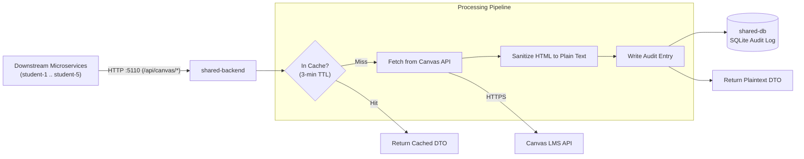

# Shared Backend — Canvas LMS API Gateway

> **Vertical Slice**: Canvas LMS Integration, In-Memory Caching, Untrusted HTML Sanitization, Request Audit Logging  
> **Tech Stack**: ASP.NET Core (.NET 10), EF Core, SQLite (`shared-db`), `HtmlAgilityPack`

---

## 1. Overview & Architecture

The shared backend is the sole microservice permitted to store `CANVAS_API_TOKEN` and communicate with the external Canvas LMS API (Rule 2). All other microservices query Canvas data indirectly through this gateway.



---

## 2. Key Capabilities

- **Strict Token Isolation**: Feature backends never receive Canvas API tokens.
- **Untrusted HTML Sanitization**: Strips dangerous scripts, styling, and embeddings from Canvas assignments, providing safe plain-text descriptions downstream.
- **In-Memory Caching**: Caches course rosters, assignments, and quizzes for 3 minutes (`IMemoryCache`) to prevent Canvas rate limiting.
- **Audit Trail**: Writes request metadata to SQLite (`shared-db`) for compliance and debugging.

---

## 3. Running Locally

```bash
# Set Canvas credentials in .env first:
# CANVAS_BASE_URL=https://<institution>.instructure.com
# CANVAS_API_TOKEN=<token>

dotnet run --project shared/backend/Api/Api.csproj
```
