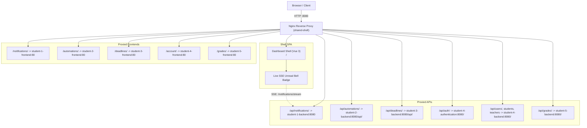

# Shared Frontend & Dashboard Shell (`shared/frontend`)

> **Role**: Unified Application Shell & Nginx Reverse Proxy  
> **Tech Stack**: Vue 3, TypeScript, Vite, Nginx (Alpine), `@better-canvas/ui-kit`  
> **Host Port**: `8080` (maps to port `80` in container)

---

## 1. Overview & Routing Architecture

`shared-shell` serves as the single public entry point for the Better Canvas platform. It hosts the dashboard overview at `/` and reverse-proxies all microservice frontends and APIs through an embedded Nginx configuration.



---

## 2. Running Locally

```bash
# Start frontend shell dev server (standalone)
npm run dev --workspace=shared-frontend

# Build for production (embedded in Nginx container)
npm run build --workspace=shared-frontend
```
