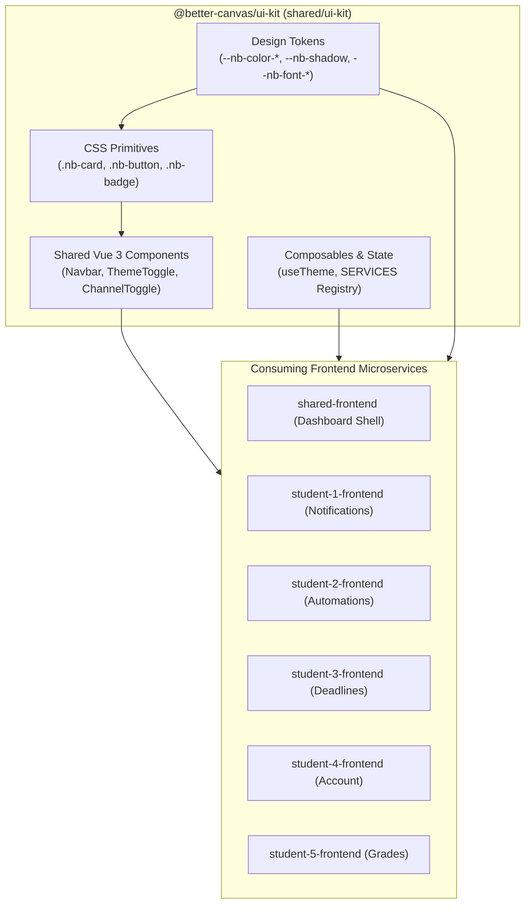

# @better-canvas/ui-kit

The canonical Neobrutalism design system, shared CSS primitives, design tokens, and reusable Vue 3 components for the Better Canvas platform.



---

## 1. Installation & Setup

`@better-canvas/ui-kit` is an npm workspace package located at `shared/ui-kit`.

To use it in any frontend microservice:

1. Add it to `package.json`:
   ```json
   "dependencies": {
     "@better-canvas/ui-kit": "*"
   }
   ```
2. Import the stylesheets in `main.ts`:
   ```ts
   import '@better-canvas/ui-kit/styles/tokens.css'
   import '@better-canvas/ui-kit/styles/primitives.css'
   ```

---

## 2. Design Tokens Reference

All design tokens are defined in `src/styles/tokens.css` and use `--nb-*` custom properties:

### Colors
- Background / surface: `var(--nb-color-bg)`, `var(--nb-color-white)`
- Text / ink (also border colour): `var(--nb-color-ink)`, `var(--nb-color-muted)`
- Accents: `var(--nb-color-accent-orange)`, `var(--nb-color-accent-yellow)`
- Shadow colour: `var(--nb-color-shadow)`

Dark mode overrides the same token names, so components never need theme
branches.

### Borders & Shadows
- Borders: `var(--nb-border-width-md) solid var(--nb-color-ink)` (`sm` 2px, `md` 3px, `lg` 4px)
- Shadows: `var(--nb-shadow)` — `6px 6px 0 var(--nb-color-shadow)`, hard and unblurred
- Border Radius: `var(--nb-border-radius)` is `0` (strict sharp corners)

### Typography, Spacing & Motion
- Fonts: `var(--nb-font-display)` (Space Grotesk) and `var(--nb-font-mono)` (JetBrains Mono); import `@better-canvas/ui-kit/styles/fonts.css` to pull them in from Google Fonts.
- Spacing scale: `--nb-space-1` … `--nb-space-16`.
- Motion: `--nb-duration-fast|base|slow`, `--nb-ease-standard|out|pop`, `--nb-transition-fast|base`.

---

## 3. Shared Components & Composables

Exported from `@better-canvas/ui-kit`:

- **`Navbar`**: Global navigation header. Takes a `services` array (pass the exported `SERVICES` registry) plus optional `homeHref` and `badge` props; renders cross-service links and the theme toggle, with a default slot for per-app content.
- **`ThemeToggle`**: Light/dark theme switch.
- **`ChannelToggle`**: Neobrutalist on/off toggle used for delivery-channel style settings.
- **`useTheme()`** and the `Theme` type: shared theme state and persistence.
- **`SERVICES`** and the `Service` / `ServiceId` types: the canonical microservice registry consumed by the dashboard tile grid and every navbar.
