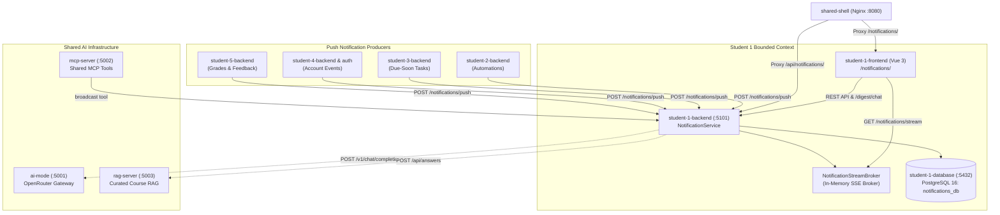

# Student 1 — Notifications & AI Chat Assistant Service

> **Owner**: Bryan Lee (`student-1`)  
> **Vertical Slice**: Notifications, Delivery Preferences, AI Chat Assistant, Real-Time SSE Stream, Shared MCP & RAG Integrations  
> **Tech Stack**: ASP.NET Core (.NET 10), EF Core, PostgreSQL 16, Vue 3, TypeScript, Vite, `@better-canvas/ui-kit`

---

## 1. Overview & Capabilities



The Notification service manages incoming academic notifications across student features, delivery channel preferences, and an intelligent AI Chat Assistant grounded in course documentation:

- **Notifications & SSE Stream**:
  - Ingestion via `POST /notifications/push` from connected microservices (e.g. `student-3-backend` due-soon reminders).
  - Real-time Server-Sent Events (SSE) broadcast over `GET /notifications/stream`.
  - Type-based filtering (`Deadline`, `Grade`, `Automation`, `Account`, `AI`) and read/unread status management.
  - Interactive notification actions (`AI BREAK DOWN`, `GRADE IMPACT`, `MARK COMPLETE`).
- **Delivery Preferences**:
  - Per-student matrix configuration across notification types and channels (`InApp`, `Email`).
- **AI Chat Assistant (Release 1)**:
  - Replaces static digests with persistent conversational sessions backed by PostgreSQL (`ChatSession`, `ChatMessage`).
  - Automatically synthesizes an unread notification summary on new session creation with an animated Neobrutalist loader.
  - Interactive Q&A augmented by the shared RAG server with source citations and confidence metrics.
  - Collapsible Past Chats drawer for quick access to conversation history.
- **Shared MCP & RAG Server Integrations**:
  - Exposes tool `notifications_broadcast_alert` on the non-containerised MCP server (`5002`) with urgency validation.
  - Consumes the shared local RAG server (`5003`) via `POST /api/notifications/rag/query` with fallback for unsupported queries.
  - Accessible via top toolbar action buttons `[🧠 QUERY COURSE RAG]` and `[⚡ MCP BROADCAST TOOL]`.

---

## 2. Local Standalone Development

### Database (PostgreSQL)
```bash
# Start dedicated PostgreSQL container
docker compose up -d student-1-database
```

### Backend (Port 5101)
```bash
dotnet run --project student-1/backend/Api/Api.csproj --urls "http://localhost:5101"
```

### Frontend (Port 5199 or 3000)
```bash
npm run dev --workspace=student-1-frontend
```

---

## 3. End-to-End Testing

```bash
# Run Playwright test suite
npm run test:e2e --workspace=student-1-frontend
```
