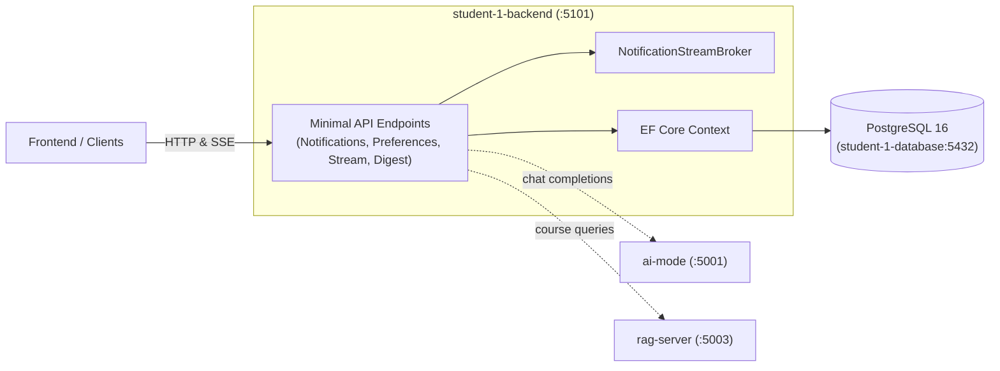

# student-1 backend
 
 ASP.NET Core API (notifications, preferences, AI digest).



## Setup

```bash
cd Api
dotnet restore
```

### Database (required)

Persistence lives in the dedicated `student-1-database` PostgreSQL container
(see `../database/README.md`). The backend connects with EF Core + Npgsql via
`ConnectionStrings:DefaultConnection`; Docker Compose points it at
`Host=student-1-database`. To run the backend standalone, start just the
database first:

```bash
docker compose up -d student-1-database
```

### AI gateway (required for AI digest generation)

`POST /digest/generate` calls the shared `ai-mode` gateway service, which holds the
OpenRouter API key. This service does not need the key itself, only the gateway's
base URL, configured via `AiGateway:BaseUrl` (defaults to `http://127.0.0.1:5001`
for standalone development). See root `CLAUDE.md` / `README.md` for the
project-wide setup.

If the base URL is missing at startup, the app logs a warning to the console.

## Run

```bash
cd Api
dotnet run
```

## Tests

`Api.Tests` holds xUnit unit tests (stream broker, DTO extensions, Canvas
notification sync, OpenRouter digest service) and integration tests built on
`Microsoft.AspNetCore.Mvc.Testing` with an in-memory SQLite test database.

```bash
dotnet test student-1/backend/NotificationService.sln
```
