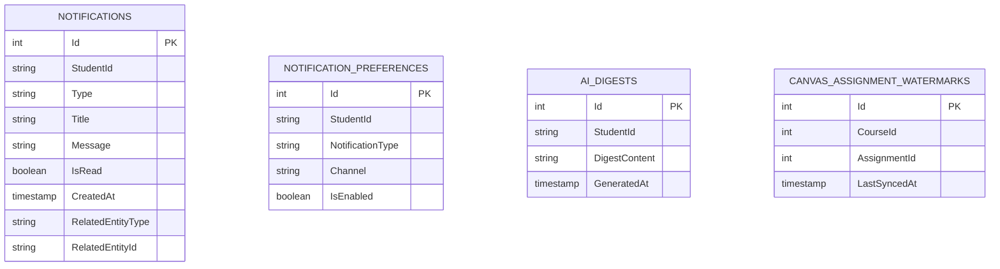

# Student 1 - Database Microservice

## Overview
The **Student 1 Database Microservice** is a containerised PostgreSQL service dedicated exclusively to Student 1's bounded context (Notifications, Delivery Preferences, AI Digests, and Canvas Assignment Sync Watermarks).

It satisfies the project specification for **Microservice Database Isolation** (Rule 1) and the requirement that each student designs, develops, and maintains an independent **Database Microservice** (Sections 2.2, 2.4, 6.3, and 7.1).

---

## Technical Specifications
- **Database Engine**: PostgreSQL 16 (Alpine)
- **Database Name**: `notifications_db`
- **Default Port**: `5432`
- **Container Name**: `student-1-database`
- **Volume Mount**: `student-1-postgres-data:/var/lib/postgresql/data`

---

## Schema Overview & Tables
The database maintains the following isolated tables:



1. **`Notifications`**:
   - Stores user alerts, type (`Deadline`, `Grade`, `Automation`, `Account`, `AI`), read status, timestamps, and optional cross-service target metadata (`RelatedEntityType`, `RelatedEntityId`, `ActionPayload`).
2. **`NotificationPreferences`**:
   - Stores granular delivery channel preferences (`InApp`, `Email`) per notification type.
3. **`AiDigests`**:
   - Stores AI-generated weekly digest summaries for students.
4. **`CanvasAssignmentWatermarks`**:
   - Maintains incremental sync high-watermarks for Canvas LMS assignments to detect updates, due date shifts, and submissions.

---

## Seeding & Verification
- `init.sql` automatically populates each table with at least ten (10) initial records upon initial container initialization.
- Entity Framework Core in `student-1-backend` (`Npgsql.EntityFrameworkCore.PostgreSQL`) manages ongoing migrations and connects via connection string.

---

## Running Standalone
To build and run the database microservice individually:
```bash
docker build -t student-1-database student-1/database
docker run -d --name student-1-database -p 5432:5432 student-1-database
```
