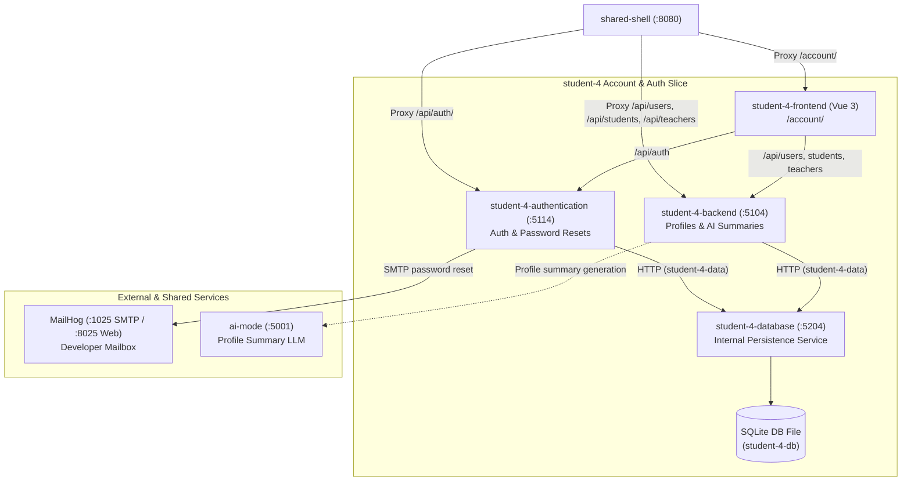

# Account service

The service manages accounts - settings, details and verification.
It has a "forgot password" prompt where it will send a user an email
to change their password. Passwords are securely stored using hashes.

AI planning calls the internal `ai-mode` gateway through the account
backend. AI profile summaries can still be edited manually, but an AI
prompt will help users generate a generic summary for their profile.
This will be expanded upon in future releases.

Future releases will focus on improving the AI summary by giving it
context from other services and expanding on user roles and
permissions.



## Standalone development

It is suggested to run all services together with Docker from the repository
root:

```powershell
docker compose up --build
```

Standalone, the slice needs three processes, each in its own terminal — the
private database service first, then the profile API and the authentication
API:

```powershell
dotnet run --project student-4\database\Database
```

```powershell
dotnet run --project student-4\backend\Api
```

```powershell
dotnet run --project student-4\authentication\Authentication
```

In another terminal, run the frontend. Vite serves it under its `/account/`
base path, so the dev URL is `http://localhost:5173/account/`:

```powershell
npm run dev --workspace=student-4-frontend
```

The dev server proxies `/api` to the profile API on port 5104. AI prompts are
unavailable unless the `ai-mode` gateway is also configured.

## Forgot Password Functionality

In testing, the email service sends mail to MailHog; read it in the web inbox
at `http://localhost:8025` (SMTP listens on port 1025).

When deployed in Release 1, SMTP details can be edited and set in the .env
file.
