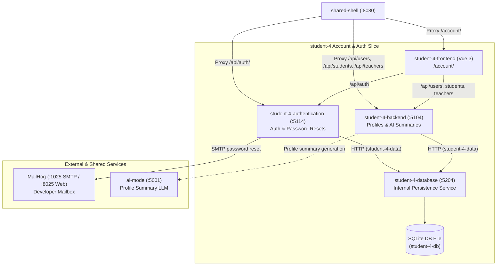

# Account service

The service manages accounts - settings, details and verification.
It has a "forgot password" prompt where it will send a user an email
to change their password. Passwords are securely stored using hashes.

AI planning calls the internal `ai-mode` gateway through the account
backend. AI profile summaries can still be edited manually, but an AI
prompt will help users generate a generic summary for their profile.
This will be expanded upon in future releases.

## Account readiness through MCP

The **03 KNOWLEDGE** page (`/account/knowledge`) contains the **ACCOUNT READINESS / MCP**
panel, which invokes the read-only
`accounts_check_readiness` tool. Click **CHECK MY ACCOUNT SETUP** to get
actionable findings about profile completeness, missing/inactive role
records, Canvas connectivity, and notification-service availability.
It does not generate text, edit accounts, or return personal field values,
password hashes, or Canvas keys.

```text
Knowledge page -> POST /api/users/{userId}/mcp-readiness
           -> shared local MCP /mcp: accounts_check_readiness(userId)
           -> GET /internal/ai-context/accounts/{userId}/readiness
              -> private Student 4 database HTTP API (profile/role checks)
              -> shared-backend /api/canvas/courses (Canvas connectivity)
              -> student-1-backend /health/ready (notification readiness)
```

Run `python tools/run_ai_services.py` alongside Docker Compose. The launcher
configures MCP's Student 4 URL as `http://127.0.0.1:5104` (override with
`--student-4-port`). Docker's account backend uses
`http://host.docker.internal:${MCP_HOST_PORT}/mcp`.

`MCP_ENABLED` in the generated `.env` controls the integration. It is
optional for account readiness, explicitly disabled in Student 4 CI, and
returns a friendly `503` when disabled or `502` when unreachable. Missing
accounts return `404`; invalid IDs are rejected. Standalone backends must
set `McpServer__Enabled` explicitly and, when enabled, `McpServer__BaseUrl`.
Set `SharedService__BaseUrl` to the Canvas gateway (`http://localhost:5110`
standalone; Docker Compose supplies its internal DNS URL).

Results contain four checks, each with `ready`, `needs_attention`, or
`unavailable`, an explanation, and an optional profile-edit action. The
overall category is `unavailable` if any dependency check is unavailable,
otherwise `needs_attention` if any setup finding needs attention, otherwise
`ready`. Dependency failures preserve the other findings. Canvas and
notification probes run concurrently with a five-second timeout each.
Canvas connectivity uses the gateway's real course-fetch route; it is not a
per-user enrolment check, and the gateway may serve cached courses.
Notification readiness is not an email-delivery
or preference check. These recommendations do not gate existing features,
change role status, or participate in backend startup/readiness.
Profile-edit actions return to **02 PROFILE** in edit mode.

The tool accepts only one non-empty account UUID, not arbitrary endpoints or
database queries. It follows the existing account-ID access model; it does
not introduce authenticated sessions or new authorization guarantees.

## Grounded Account Help through RAG

The **03 KNOWLEDGE** page's **ACCOUNT HELP / RAG** panel answers documentation
questions about registration, profile editing, roles, password changes,
reset emails, account deletion, and MCP readiness findings. It does not
inspect your account, perform actions, or replace the existing AI summary
generator. Do not enter passwords, reset tokens, or API keys.

```text
Account Help UI -> POST /api/users/help/answers { question }
                -> local RAG /api/answers { question, scope: "student-4" }
                -> retrieve student-4 Markdown excerpts
                -> local AI Mode -> OpenRouter
                -> answer + server-derived citations + confidence
```

The launcher includes this README and
[`docs/account-help.md`](docs/account-help.md) in the curated corpus.
Student 4 scope searches only sources under `student-4/`, so unrelated
feature documentation cannot become an account-help citation. Existing
Student 1/3 retrieval behavior is unchanged. Responses show `low`, `medium`,
or `high` retrieval-based confidence, source titles/headings/paths, and the
number of matched excerpts. No relevant chunks returns `insufficient_context`
without calling the model; the model can also decline an unsupported question.

`RAG_ENABLED` and `RAG_HOST_PORT` come from the generated `.env`. Docker
routes the backend to `http://host.docker.internal:${RAG_HOST_PORT}`.
Standalone backends must set `RagServer__Enabled` explicitly and, when
enabled, `RagServer__BaseUrl`. Disabled RAG returns `503`; service/model
failures return a friendly `502`. Questions must contain 3-500 trimmed
characters. CI explicitly disables both MCP and RAG, and backend readiness
continues to depend only on its database.

Restart `python tools/run_ai_services.py` after editing corpus files because
documents are indexed at startup.

Future releases will focus on improving the AI summary by giving it
context from other services and expanding on user roles and
permissions.



## Standalone development

It is suggested to run all services together with Docker from the repository
root:

```powershell
docker compose up --build
```

Standalone, the slice needs three processes, each in its own terminal — the
private database service first, then the profile API and the authentication
API:

```powershell
dotnet run --project student-4\database\Database
```

```powershell
dotnet run --project student-4\backend\Api
```

```powershell
dotnet run --project student-4\authentication\Authentication
```

In another terminal, run the frontend. Vite serves it under its `/account/`
base path, so the dev URL is `http://localhost:5173/account/`:

```powershell
npm run dev --workspace=student-4-frontend
```

The dev server proxies `/api` to the profile API on port 5104. AI prompts are
unavailable unless the `ai-mode` gateway is also configured.

## Forgot Password Functionality

In testing, the email service sends mail to MailHog; read it in the web inbox
at `http://localhost:8025` (SMTP listens on port 1025).

SMTP details can be edited and set in the .env file. Please see below:

The authentication service sends email through Gmail SMTP at `smtp.gmail.com`
on port `587` using STARTTLS. Set these environment variables before starting
the service:

```text
Email__FromAddress=your-account@gmail.com
Email__Smtp__Username=your-account@gmail.com
Email__Smtp__Password=your-google-app-password
```

Use a Google App Password generated for an account with 2-Step Verification
enabled; your regular Google password will not work. Keep the app password in
your environment or secret store, not in source control. The From address must
be the authenticated Gmail address or an alias configured in Gmail.