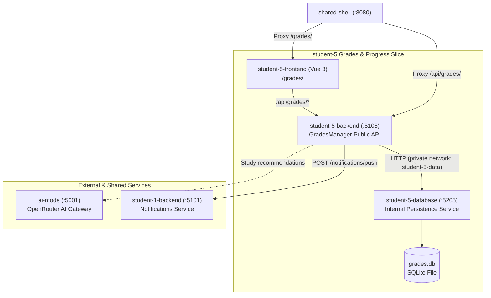

# Student 5 — Grades & Progress Service

> **Owner**: William Hannah (`student-5`)  
> **Vertical Slice**: Grades Management, What-If Simulator, Target GPA Calculation, AI Study Recommendations  
> **Tech Stack**: ASP.NET Core (.NET 10), EF Core, SQLite, Vue 3, TypeScript, Vite, `@better-canvas/ui-kit`

---

## 1. Overview & Capabilities

The Grades & Progress microservice enables students to track current assignment marks, model hypothetical "what-if" grade outcomes, and receive tailored AI study recommendations:

- **Marks & Course Tracking**:
  - Displays real-time grade breakdowns per enrolled course and assignment category.
  - Allows managing desired target marks per student (`/api/grades/api/students`).
- **What-If Grade Simulator**:
  - Interactive scenario simulator calculating projected course percentage and GPA impact without overwriting real Canvas data.
  - Temporary mark overrides via `POST/PUT /api/grades/api/assignment/marks/`.
- **AI Study Recommendations**:
  - Synthesizes personalized study advice via `POST /api/grades/api/ai/generate-recommendation` calling the shared `ai-mode` gateway.
- **Architectural Isolation**:
  - Persistence is isolated in `student-5-database` on internal network `student-5-data`. The public API contains no EF Core dependencies.



---

## 2. Standalone Development

### Database Service (Port 5205)
```bash
# Terminal 1: Run private database service
dotnet run --project student-5/database/Database/Database.csproj --urls http://localhost:5205
```

### Backend (Port 5105)
```bash
# Terminal 2: Run public API
dotnet run --project student-5/backend/GradesManager/GradesManager/GradesManager.csproj --urls http://localhost:5105
```

### Frontend (Port 3005)
```bash
# Terminal 3: Run Vue 3 frontend
npm run dev --workspace=student-5-frontend
```

---

## 3. Key Endpoints

- `GET /api/courses` — Course listings.
- `GET /api/students/{id}` — Student records and ideal marks.
- `POST|PUT /api/assignment/marks/` — Temporary ("what-if") marks simulation.
- `POST /api/ai/generate-recommendation` — AI study recommendation via `ai-mode`.
