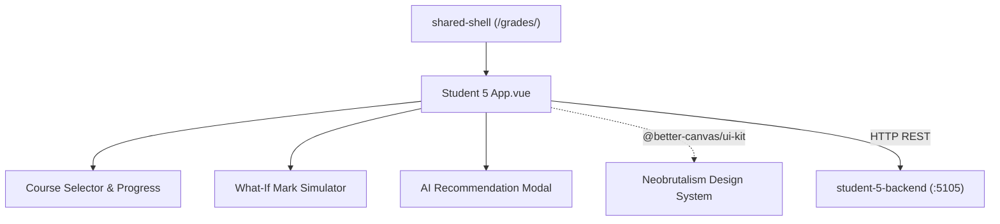

# Grades & Progress Frontend

Vue 3 frontend for viewing a student's current and desired marks, browsing enrolled courses and assignments, and testing temporary marks to project course results.

## Development

The app expects the grades backend at `http://localhost:5105` during Vite development.

- `npm run dev --workspace=student-5-frontend` starts local build.
- In Docker Compose, open the feature under `/grades/` through the shared shell.
